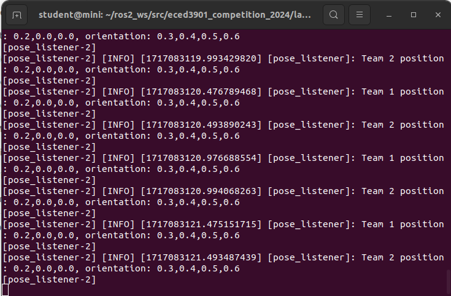

# ECED3901 Competition 2024
A ROS2 package to be used to connect both teams to the UI in the ECED3901 2024 competition


## Competition Integration Overview

Each team will be required to conform to the following standards to interface with the competition nodes.

1. A physical switch on the robot must be used to switch between team 1 and team 2.
2. The robot must publish it's team number in the form of an std_msgs/Int32 at 2Hz to the topic '/team_x_ready' where x is team 1 or team 2.
3. The robot must continuously publish it's pose in the form of a geometry_msgs/Pose at 2Hz to the topic '/team_x_pose' where x is team 1 or team 2.
4. The robot must subscribe to the topic '/CompetitionStart' and start the competition when it receives an empty message on this topic. This topic will continue to be published with empty messages at 2Hz.
5. All other topics must be within the team's namespace to avoid topic collision.

## Description

This package contains three python files:

 - **pose_listener:** This node should subscribe to your team's robot pose as '/team_1_pose' or '/team_2_pose' and print to console whenever it receives a message.
 
 - **competition_publisher:** Once the competition is started this node will continuously publish empty messages to '/CompetitionStart'
 
 - **test_student:** This node demonstrates what your robot should be doing to interact with the competition nodes.
 
## Installation

To use this package, clone the repository into your ROS2 workspace and colcon build the package. The package should be on the same directory level as your eced3901 package.

```bash
cd /ros2_ws/src
git clone https://github.com/JasperGrant/ECED3901-Competition-2024
cd ..
colcon build
```


## Namespaces

To avoid topic collision, each team must have all of their topics outside of /CompetitionStart, /team_1_pose or /team_2_pose, and /team_1_ready or /team_2_ready inside their own namespace. The naming convention is not strict as long as it has your team number in it. This is left intentionally vague so that a team cannot just publish malicious data to every other team number's namespaces.

An example of how to set a namespace for your nodes is shown below:

```bash

ros2 run my_package my_executable --ros-args --remap --namespace=/team_1_cool_namespace
```

The problem with using a namespace this way is that you will remap your CompetitionStart and pose topics to the /team_1_cool_namespace namespace. To avoid this you can remap these nodes in your namespace to the global ones. This is best done in a launch file. An example of how to do this is shown below:


```python
Node(
	package='eced3901_competition_2024',
    namespace='namespace_team_15',
	executable='test_student',
	name='team_15_robot',
	arguments='2',
	remappings=[
		('/namespace_team_15/team_2_pose', '/team_2_pose'),
		('/namespace_team_15/CompetitionStart', '/CompetitionStart')
		('/namespace_team_15/team_2_ready', '/team_2_ready')
	],
	output='screen'
)
```

If everything is working correctly you should notice the lack of /CompetitionStart, /team_1_pose, or /team_2_pose, and /team_1_ready or /team_2_ready topics in the namespace. Only their global versions are shown. Every other topic from each robot is in their respective namespace.

To see this for yourself run the demo.launch.py file included in this repo.

## Pose Convention

To properly show the position of both robots on the UI a pose convention must be set. This convention is individual to each team so the opposing team will see the field with your (193,145) as their (0,0) and your 0 radians as their PI radians.

This is to say that each team will operate with their corner of origin as (0,0). We will perform the calculation to correct this in the UI, and you will only have to worry about the other team's orientation being flipped if you intend to use their pose data.

The x-axis will be the long side of the field and the y-axis will be the short side of the field. All coordinates are in inches.

While the orientation member of the pose message is typically a quaternion, we will take the /team_x_pose/orientation/z member to mean the robot's orientation about the z axis in radians. Here the X-axis represents the origin of 0 degrees and the angle in radians is measured in the counter-clockwise direction. This should be wrapped between -PI and PI. Exactly like the unit circle. Keep in mind this will also be flipped between teams but you only need to worry about your own team's orientation.


## Testing

### Communication with Competition Nodes

Follow the instructions below to test the communication between your robot and the competition nodes.

1. Start the pose_listener node by running the following command:

```bash
ros2 run eced3901_competition_2024 pose_listener
```

You should not see any output.

1. Start your robot node.

```bash
ros2 run eced3901_competition_2024 test_student 1
```

**OR** 

```bash
ros2 run eced3901_competition_2024 test_student 2
```

The robot node should publish it's team number to the topic '/team_1_ready' or '/team_2_ready'.

You should still not see any output from the pose_listener node.

1. Start the competition_publisher node by running the following command:

```bash
ros2 run eced3901_competition_2024 competition_publisher
```

You should see the pose of your robot being printed to the console by the pose_listener node.

You should now see the robot publishing it's pose to the topic '/team_1_pose' or '/team_2_pose' and it's team number to the topic '/team_1_ready' or '/team_2_ready'.
The competition_publisher node should be publishing empty messages to the topic '/CompetitionStart'.

An example below shows both test_student robots running at the same time:



## FAQ

**Q: I am changing my code but the changes are not showing up?**
A: Delete the build and install folders in /ros2_ws and rebuild the package. Either your executables will be built from the newest version or they will fail to build and you can see the error messages.